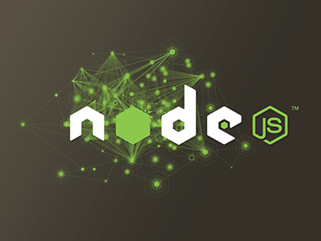

<!--

WARNING!! DON'T EDIT THE FILE README.md on the root of the project, that one is a GENERATED FILE!

You should just edit the source file at src/README.md - the one which stars with ## NodeJS and Express

-->

## NodeJS and Express




Victor Gomes @ [Avenue Code](http://www.avenuecode.com)

*vgomes@avenuecode.com*

May 15th, 2014

---

## Agenda

- NodeJS
  - Warm up with Node.js
- ExpressJS
  - Working with Express
  - Express Project Files
  - package.json
  - request methods
  - response methods
  - Views with Jade
  - Views with EJS
  - nodemon

---

## Prerequisites

- JavaScript Knowledge
- Have [Node.JS](http://nodejs.org) installed

---

## Let's talk about Node.js

 - Node.js is a platform built on *Chrome's JavaScript runtime* (V8) for easily building fast, Node.js was written almostly all in C
 - The back-end you'll be writen will be only in *javascript*
 - non-blocking I/O, one small request doesn't need to wait for the server deliver one fat request before response
 - Scalable network applications
 - Event-driven
 - Real time apllications, through websockets (*socket.io*)
 - Node.js have a powerfull Packager Manager, named *NPM*
 - Perfect for data-intensive real-time applications that run across distributed devices

---

## Warm up with Node.js

1. Let's write our first Node.js webserver
```sh
var http = require("http");
http.createServer(function(request, response) {
 response.writeHead(200);
 response.write("Hello world, this is my first webserver");
 response.end();
}).listen(8800);
console.log("Webserver started");
```
2. Save as *webserver.js* and run it
```sh
$ node webserver.js
```

---

## Express Framework Description

This Node.js module is a fast, unopinionated, minimalist web development framework inspired by Sinatra. The Express philosophy is to provide small, robust tooling for HTTP servers. Making it a great solution for single page applications, web sites, hybrids, or public HTTP APIs. Built on Connect you can use only what you need, and nothing more, applications can be as big or as small as you like, even a single file. Express does not force you to use any specific ORM or template engine. With support for over 14 template engines via Consolidate.js you can quickly craft your perfect framework.

---

## Working with Express

1. Install express
```sh
# npm install -g express
```
2. Create a new project
```sh
$ mkdir new_project && cd new_project
$ express
```
3. Install dependencies
```sh
$ npm install
```
4. Run new_project
```sh
$ node app
or
$ npm start
```
5. Visit http://localhost:3000/

---

## Express project files

 - app.js
 - package.json
 - routes/
  - index.js
  - user.js
 - views/
  - index.jade
  - layout.jade
 - public/
  - images/
  - javascripts/
  - stylesheets/

---

## package.json

```sh
{
  "name": "application-name",
  "version": "0.0.1",
  "private": true,
  "scripts": {
    "start": "node app.js"
  },
  "dependencies": {
    "express": "~3.5.1",
    "jade": "*"
  }
}
```
 - Dependency's semantic version [major][minor][patch]
   - "*" means it will always get the latest version available
   - "3.5.x", "3.5.*", "~3.5.0" will update only patchs of 3.5
   - "~3.5" means it will update till version 3.9 
   - Whatch out "~3.5.*" updates from 3.5.0 to 3.9.9

---

## request methods
 - app.js
   - app.get(req, res)
```sh
app.get('/api/users', user.list);
app.get('/api/users/:id', user.get);
```
   - app.post(req, res)
```sh
app.post('/api/users', user.create);
```
   - app.put(req, res)
```sh
app.put('/api/users/:id', user.update);
```
   - app.delete(req, res)
```sh
app.delete('/api/users/:id', user.delete);
```

---

## response methods
 - response.send('Return any string');
 - response.redirect('/');
 - response.render('index');
   - routes/index.js response example:
```sh
exports.index = function(req, res){
  res.render('index', { title: 'Avenue Code' });
};
```
 - response.json( { attribute: value } );
   - routes/user.js API examples with mongoose *below*

----

## 1/5 - list
```sh
exports.list = function(req, res) {
  User
    .find()
    .exec(function(err, users) {
      if(err) {
        console.log(err);
      } else  {
        res.json(users);
      }
    });
};
```

----

## 2/5 - get
```sh
exports.get = function(req, res) {
  var id = req.params.id;
  User
    .findOne({_id: id})
    .exec(function(err, users) {
      if(err) {
        console.log(err);
        res.json(err);
      } else  {
        res.json(users);
      }
    });
}
```

----

## 3/5 - create
```sh
exports.create = function(req, res) {
  var data = req.body;
  var dados = {
    name: data.name,
    email: data.email,
    password: data.password
  }
  var user = new User(dados);
  user.save(function(err, data) {
    if(err) {
      res.json(err);
    } else {
      res.json(data);
    }
  });
}
```

----

## 4/5 - update
```sh
exports.update = function(req, res) {
  var id = req.params.id;
  var data = req.body;
  var dados = {
    name: data.name,
    email: data.email,
    password: data.password
  }
  User.update({_id: id}, dados, function(err, data) {
    if(err) {
      res.json(err);
    } else {
      res.json(data);
    }
  });
}
```

----

## 5/5 - delete
```sh
exports.delete = function(req, res) {
  var id = req.params.id;
  User.remove({_id: id}, function(err, data) {
    if(err) {
      res.json(err);
    } else {
      res.json(data);
    }
  })
}
```


---

## Views with Jade

 - Express by default uses Jade as template engine
   - In Jade indentation matters
   - Jade don't allow you to mix spaces and tabs indentation
   - In Jade you don't close tags, so it make easier to handle your front-end code
   - Jade can include view parts
   - Jade looks a lot like Ruby Slim (template engine for Ruby on Rails), but it's not the same thing!

---

## Using pure html template engine (EJS)

 - install and add EJS to your package.json
```sh
$ npm install ejs --save
```
 - Change the defaut template engine at yours app.js, from:
```sh
app.set('view engine', 'jade');
```
 - to:
```sh
app.set('view engine', 'ejs');
```
 - Or, you could just start a new express project with EJS:
 ```sh
$ express --ejs
```

---

## nodemon

 - Nodemon watch your project files for change, everytime you change your code it will restart the node server for you.
1. Install nodemon globaly
```sh
$ npm install -g nodemon
```
2. Change new_project start service to use nodemon instead node, at package.json
```sh
"scripts": {
    "start": "nodemon app.js"
}
```
3. Start new_project
```sh
$ npm start
```

---

## Conclusion

- Express will really help you to start an RESTfull API easily.
- MEAN stack is an new concept to fast delivery a system prototype, making use of MongoDB, Express, Angular JS and Node JS.

---

## Learn more

1. [ExpressJS API Reference](http://expressjs.com/4x/api.html)
2. [ExpressJS at Github](https://github.com/visionmedia/express)
3. [ExpressJS MVC template](https://github.com/visionmedia/express/tree/master/examples/mvc)
3. [Mongoose](http://mongoosejs.com/)

---

## CHALLENGE

- To create your own user API with express you will need to keep the data somewhere, in this challenge you need to implement a database.
 1. Create a new project as you learn here, with the user's API requests setted at app.js
 2. Implement any database of any kind you want, you choose, MongoDB, MySQL, SQL, NoSQL, Graph, SQLlite, whatever...
&nbsp;
- *TIP:*  for fast development/prototyping I would recommend you to keep on the MEAN Stack and use *MongoDB* through *mongoose*, you can find some *examples below slide 10*


